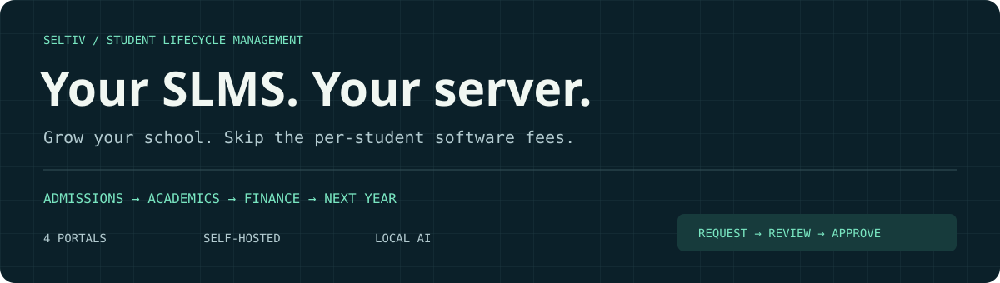
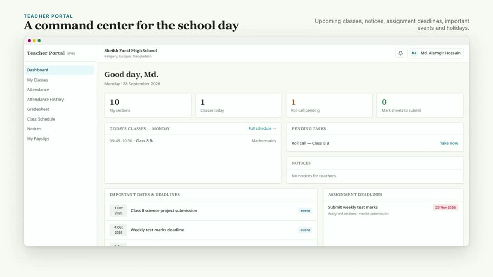
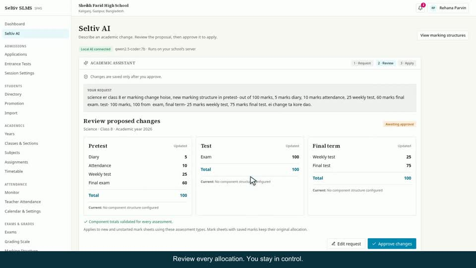
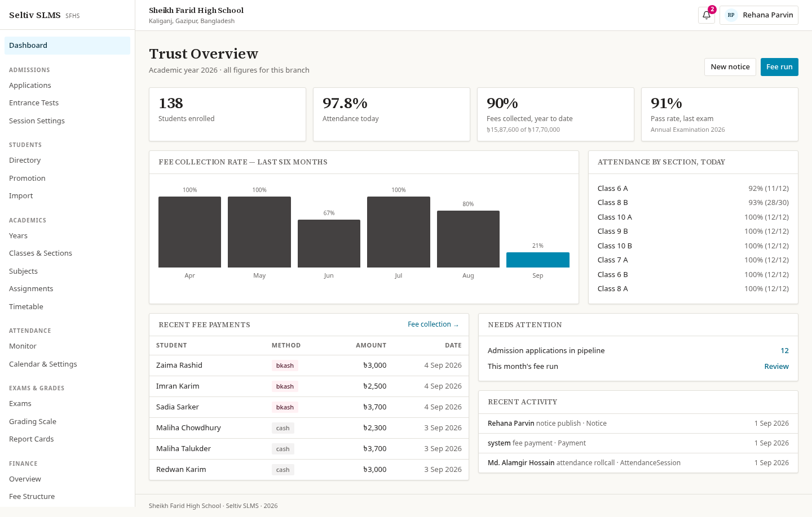

<p align="center">
  
</p>

<p align="center">
  <a href="#watch-it-work">Watch the demos</a> ·
  <a href="#built-in-ai-for-academic-changes">Meet Seltiv AI</a> ·
  <a href="#getting-started">Run it yourself</a> ·
  <a href="https://sudipta.seltiv.com">Meet the developer</a>
</p>

# Seltiv SLMS

**Your SLMS. Your server. No per-student software fees.**

Run admissions, attendance, academics, fees, payroll, and parent communication from one Student Lifecycle Management System. Give administrators, teachers, parents, and accountants their own workspace. Keep the application and database on infrastructure you control.

**Built-in AI makes academic changes easier:** describe a marking change in English, বাংলা, or Banglish, review the proposed allocations, and approve it. The model runs locally through Ollama.

Originally built for the four schools of the Sheikh Farid Ahmed Education and Welfare Trust. Each branch has its own application process, database, and configuration.

## Why self-host?

- **Enrollment doesn't multiply a software subscription.** This repository has no per-student billing mechanism. You operate your own deployment.
- **Your infrastructure, your data.** Choose your server and MongoDB deployment; manage backups and access yourself.
- **Local AI.** Run the academic assistant on your own hardware without a hosted model API key.
- **One connected school workflow.** Move from applications to enrollment, marks, results, fees, and the next academic year.

Hosting, storage, backups, messaging, and AI compute still have operating costs and may grow with usage. Self-hosting removes per-student software charges; it does not make infrastructure unlimited.

## Watch it work

### Product tour · 1:18

[](public/walk-short.mp4)

[▶ Watch the quick tour](public/walk-short.mp4) · [▶ Watch the full walkthrough — 5:24](public/walk-long.mp4)

### Seltiv AI in the actual app · 0:47

[](video/ai-live/seltiv-ai-live.mp4)

[▶ Watch request → review → approve → reload](video/ai-live/seltiv-ai-live.mp4)

Recorded against the running application with a local Qwen model and MongoDB persistence. Model waiting time is shortened and disclosed in the video captions.

### Explore the workflows

| Video | Length | What you'll see |
|---|---:|---|
| [Grading walkthrough](video/grading-walkthrough/seltiv-grading-walkthrough.mp4) | 1:14 | The grading workflow and report card |
| [Teacher marks entry](video/marks-entry/seltiv-marks-entry-8a.mp4) | 0:44 | Class 8A marks entry and submission |
| [Year-end promotion](video/promotion/seltiv-promotion-walkthrough.mp4) | 1:10 | Next-year enrollment, section placement, and held-back students |
| [Admissions to promotion — extended demo](docs/media/admissions-to-promotion.mp4) | 3:31 | Applications, offers, promotion rules, review, graduation, and next-year sections |
| [Product highlights](brag-output/brag.mp4) | 0:20 | Admin, teacher, and parent portal highlights |
| [Earlier product overview](brag-output-2026-09-23-020723/brag.mp4) | 0:45 | A broader introduction to the school workflows |

The extended admissions-to-promotion recording shows the local development version; some screens differ from the current default branch. The demos use seeded school records. Payment scenes demonstrate the mock bKash integration.

<details>
<summary>Design archive: the original AI concept video</summary>

[Watch the earlier AI concept — 0:44](video/ai-grading/seltiv-ai-grading.mp4). This is a staged interface concept. The actual implemented feature is shown in the Seltiv AI recording above.

</details>

## Four portals, one school day

| Workspace | What it handles |
|---|---|
| **Administration** | Admissions, student records, academics, attendance monitoring, exams, results, promotion, notices, staff, roles, settings, and audit history |
| **Teachers** | Class lists, roll call, component-based marks entry, gradesheets, timetable, notices, and payslips |
| **Parents** | Child profiles, attendance, grades, fees, notices, certificates, and service requests |
| **Accounts** | Fee collection, invoices, dues, reminders, installments, payroll, payslips, payment reconciliation, and reports |

<p align="center">
  
</p>

## Built-in AI for academic changes

Change marking structures by describing what you need:

> For Class 8 Science, set Pretest to 100 marks: diary 5, attendance 10, weekly test 25, and final exam 60.

1. **Request.** Enter the class, subject, assessment periods, and component marks in English, Bengali, or Banglish.
2. **Review.** Seltiv validates the model's response and displays current and proposed allocations.
3. **Approve.** An administrator confirms the change. The application saves it with approval history.
4. **Use it.** New and unstarted mark sheets use the approved structure. Sheets with saved marks retain their original allocation.

The assistant currently handles **Pretest, Test, and Final term marking components**. It sends the request and class/subject catalog to the configured Ollama endpoint; student records are not included. It does not edit arbitrary application code or recalculate published results.

[Read the AI feature and setup guide →](docs/ai-grading.md)

## Getting started

### Requirements

- Node.js 22 and npm
- A running MongoDB instance
- Optional: Ollama with `qwen2.5-coder:7b` for Seltiv AI

### 1. Install and configure

```bash
git clone https://github.com/sudiptacmd/seltiv-slms.git
cd seltiv-slms
npm ci --legacy-peer-deps
cp .env.example .env.local
```

Edit `.env.local`: set `MONGODB_URI`, school identity, `APP_URL`, and unique `AUTH_SECRET` and `CRON_SECRET` values. Generate each secret with `openssl rand -base64 32`.

### 2. Seed an empty development database

```bash
npm run seed
npm run dev
```

Open [localhost:3000](http://localhost:3000). The seed command refuses an existing database. `npm run seed -- --fresh` deletes existing data before reseeding; use it only for disposable demo databases.

<details>
<summary>Demo accounts</summary>

These accounts are created by the demo seed. Their password is `password123`.

| Role | Phone |
|---|---|
| Admin | `01700000001` |
| Teacher | `01700000010` |
| Teacher | `01700000011` |
| Accountant | `01700000020` |
| Parent | `01700000030` |

Replace demo accounts and passwords before exposing a deployment publicly.

</details>

### 3. Enable local AI

With Ollama installed and running:

```bash
ollama pull qwen2.5-coder:7b
```

```dotenv
OLLAMA_BASE_URL=http://127.0.0.1:11434
OLLAMA_MODEL=qwen2.5-coder:7b
```

Open **Admin → Seltiv AI**. Run Ollama on the same host or use a private endpoint reachable by the application server. Choose hardware with enough memory for the model and the school workload.

## Deployment and integrations

Each school branch runs its own Node.js process and MongoDB database. Build with `npm run build`, serve with `npm start`, and put a TLS reverse proxy in front. Configure scheduled attendance and fee-reminder jobs for your deployment.

| Service | Current integration |
|---|---|
| Database | MongoDB through Mongoose |
| Images | Cloudinary, with local disk fallback |
| Documents | React PDF; Supabase Storage, with local disk fallback |
| Email | SMTP through Nodemailer; local `.eml` files in development |
| SMS | Placeholder adapter that records messages; connect a real gateway for delivery |
| Payments | Mock bKash checkout; connect and verify a real payment provider before taking payments |
| AI | Server-side Ollama, defaulting to Qwen 2.5 Coder 7B |

[Deployment guide →](docs/DEPLOYMENT.md) · [Environment reference →](.env.example)

## Development

Built with **Next.js 16, React 19, TypeScript, Tailwind CSS 4, MongoDB, and NextAuth**.

| Command | Purpose |
|---|---|
| `npm run dev` | Start development server |
| `npm run build` / `npm start` | Build and serve |
| `npm run typecheck` | TypeScript checks |
| `npm test` | Unit tests |
| `npm run test:e2e` | Playwright flows |

This is an actively developed project. Some full-repository TypeScript issues are documented in the [AI implementation notes](docs/ai-grading.md#validation). The videos demonstrate specific workflows, not a claim that every production integration is complete.

---

Built by **[Sudipta Goswami](https://sudipta.seltiv.com)** · [Discuss a deployment](mailto:sudiptagoswami63@gmail.com)
